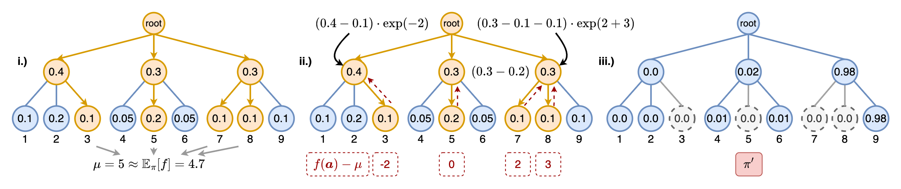

# Gumbeldore: Self-Improvement for Neural Combinatorial Optimization

This is the official repository for the paper [Self-Improvement for Neural Combinatorial Optimization: Sample Without Replacement, but Improvement](https://arxiv.org/abs/2403.15180),
using PyTorch. Parallelization is done with [ray.io](https://ray.io).



---

## Reproduce results

To provide a low-entry barrier, we assembled a reproduction script that loads the model checkpoints for TSP, CVRP, and JSSP and reproduces the greedy results reported in the paper. Run with

```
$ python reproduce.py
```
The reproduction script is set up to perform evaluation with four parallel workers that do model inference on the CPU. To align this with your hardware, change the variables `CUDA_VISIBLE_DEVICES` and `devices_for_eval_workers` and `beams_with_batch_sizes` at the beginning of the script. For example, to perform evaluation with 16 workers on two GPUs and a batch size of 64 for greedy evaluation, we set:

```
CUDA_VISIBLE_DEVICES = "0,1"  # Must be set for ray, as it can have difficulties detecting multiple GPUs
devices_for_eval_workers = ["cuda:0"] * 8 + ["cuda:1"] * 8  # i-th entry is the device that the i-th worker should use for evaluation
beams_with_batch_sizes = {
    1: 64  # Beam width 1 (= greedy) with a batch size of 64 per worker.
}
```

## Overview

The directory `core` contains the, well, core of our method. In the file `core/train.py` is the method `main_train_cycle`, which is used both for supervised and Gumbeldore training. It sets up the whole data loading/checkpoint saving/iterate over epochs cycle, and the files `jssp_main.py`, `tsp_main.py`, `cvrp_main.py` all pass their problem-specific methods to `main_train_cycle`.

When training with Gumbeldore, `core.GumbeldoreDataset` is the general class which generates random instances, and distributes them to multiple parallel workers. The workers sample with Gumbeldore and maintain the trie via `core.IncrementalSBS`. In particular, the files `core/incremental_sbs.py` and `core/stochastic_beam_search.py` contain everything regarding the sampling mechanism.

Once sampled, trajectories are saved as a pseudo-expert solution to disk in a pickle-file. All dataset loading and preparation is performed in `<tsp,cvrp,jssp>/dataset.py`. For information about the structure of the pickle files, see the README under `./data`.

## Config

For each problem class `tsp`, `cvrp` and `jssp`, we specify all options in  `config.py`. The different options should be well-commented, let us know if there are any problems to get something running!

While the implementation performance can certainly be improved, we want to put focus on the following options which are crucial to get a good performance from your hardware:

- `CUDA_VISIBLE_DEVICES`: ray.io sometimes needs help to recognize multiple GPUs. This variable will be set as the env var of the same name in each worker.
- `num_dataloader_workers`: Number of parallel dataloader workers to prepare batches.
- `training_device`: Device on which network training is performed.
- `devices_for_eval_workers`: List of devices on which evaluation is performed. Here, the i-th worker uses the i-th device.

### Gumbeldore config

In each config object, there's the dictionary `gumbeldore_config` that specifies how Gumbeldore sampling is performed. As there are a lot of options to finetune the sampling, we go through the options here in detail:

- `active_search` [str]: Optional string, defaults to `None`. If given, the instances for which solutions are sampled are not created randomly, but loaded from the given path. Can be used for a kind of active search, where the model is finetuned to the given instances at hand. This had no relevance in the paper.
- `use_best_model_for_generation` [bool]: If this is True - which is the way the paper uses it - the current best greedy model is used for trajectory generation. If False, simply the current model in each epoch is used.
- `append_if_not_new_best` [bool]: If True (as in paper), we don't empty the dataset after an epoch if the model has not improved. For debugging purposes on new problem classes, it can be helpful to turn this off until a good balance of number of instances/solution quality/training time was found, so that the model does not overfit to the generated data.
- `devices_for_workers` [List[int]]: List of devices where the i-th data generation worker uses the i-th device. Length of the list specifies number of workers then.
- `num_instances_to_generate` [int]: Number of instances to generate in each epoch. For JSSP, see the corresponding config, as it's structured a bit differently.
- `destination_path` [str]: Path to save the generated pickle with the instances and best found solution.
- `batch_size_per_worker` [int]: Batch size for each worker on a GPU. For JSSP, as above, see comments in config file.
- `batch_size_per_cpu_worker` [int]: Batch size for each worker on a CPU (usually smaller than for GPU, e.g., 1).
- `search_type` [str]: Sampling and policy update type. Must be "wor" (sample without replacement using round-wise SBS), "gumbeldore" (our method), or "theory_gumbeldore" (locally estimated advantage with theoretical policy improvement).
- `beam_width` [int]: Beam width k for Stochastic Beam Search in each round.
- `num_rounds` [int]: Number of sampling rounds.
- `pin_workers_to_core` [bool]: Defaults is False. If True, workers are pinned to single CPU threads, which can help with many workers on the CPU to prevent them from jamming each other with their numpy and pytorch operations.
- `advantage_constant` [float]: Policy update step size 'sigma' in the paper. For policy_improvement, we update the logits by adding the normalized advantage times `advantage_constant`. This should be tuned manually specifically to the problem at hand.
- `min_max_normalize_advantage` [bool]: If True, we perform a min max normalization on the advantages so the highest/lowest advantage is 1/-1. Default is False.
- `expected_value_use_simple_mean` [bool]: If True, we do not compute the expected value using Gumbels and importance sampling, but simply calculate the arithmetic mean of the leaf outcomes. Defaults to False.
- `use_pure_outcomes` [bool]: If True, we do not subtract the expected value from the actual outcomes, but simply return the outcome uncentered. This can be desirable in, e.g., a board game situation, where we want to value wins/losses regardless of the expected value of the trajectories. In particular,                we only use it for Gomoku.
- `normalize_advantage_by_visit_count` [bool]: If True, we divide the accumulated advantage of a node by its visit count. This shifts the search method further towards a Gumbel AlphaZero-type update. Can be beneficial in conjunction with `use_pure_outcomes` set to True. Can be used for Gomoku. For the paper, we use it nowhere.
- `perform_first_round_deterministic` [bool]: If True, the first Gumbeldore round is a simple deterministic beam search round, to get the exploitation of the policy "out of the system". The probability mass of the beam search trajectories is subtracted from the tree, but no advantage is propagated. In the paper's Appendix, we mention that a combination of Gumbeldore and deterministic beam search can be a powerful inference technique. This can be done with this option for example. 
- `min_nucleus_top_p` [float]: p_min in the paper. If smaller than 1, couples SBS with Top-p (nucleus) sampling, where we increase p linearly to 1 starting from `min_nucleus_top_p` over the rounds.

## Data

### Model checkpoints

Trained model checkpoints mentioned in the paper can be found in the directory `./model_checkpoints`. 

### Training data location

Due to size constraints, only validation and test data can be found under `./data`. For supervised training for CVRP and TSP, find the datasets with one million training instances [here](https://syncandshare.lrz.de/getlink/fiLUVCUACfFMNJobN7hNes/).

### Data description.

See README in directory `./data`. 

### Un-silencing GumbeldoreDataset

When generating data in an epoch with `core.GumbeldoreDataset`, we use tqdm to track the progress with a visual progress bar while collecting the data from parallel workers. However, as `ray.get` is called on the workers after all data has been collected, the program will stall without throwing an error if an error occurs in one of the workers. If you think you are experiencing that, place a `ray.get` after the future tasks have been created and before tqdm in `core/gumbeldore_dataset.py` as follows:

```
# Kick off workers
  future_tasks = [
      async_sbs_worker.remote(
          self.config, job_pool, network_weights, device,
          batch_size_gpu if device != "cpu" else batch_size_cpu,
          self.beam_leaves_to_result_fn,
          self.get_network_fn, self.trajectory_cls,
          cpu_cores[i], memory_aggressive
      )
      for i, device in enumerate(self.devices_for_workers)
  ]
+ ray.get(future_tasks)  # PLACE THIS LINE HERE
  with tqdm(total=len(problem_instances)) as progress_bar:
      while None in results:
```

This will turn off live updates in the progress bar, but errors are thrown correctly. 

## Acknowledgments

Thanks to the following repositories:

- [stochastic-beam-search](https://github.com/wouterkool/stochastic-beam-search/tree/stochastic-beam-search)
- [rezero](https://github.com/majumderb/rezero)
- [LightZero](https://github.com/opendilab/LightZero)
- [unique-randomizer](https://github.com/google-research/unique-randomizer)